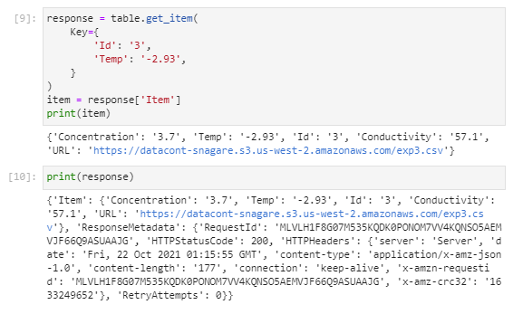
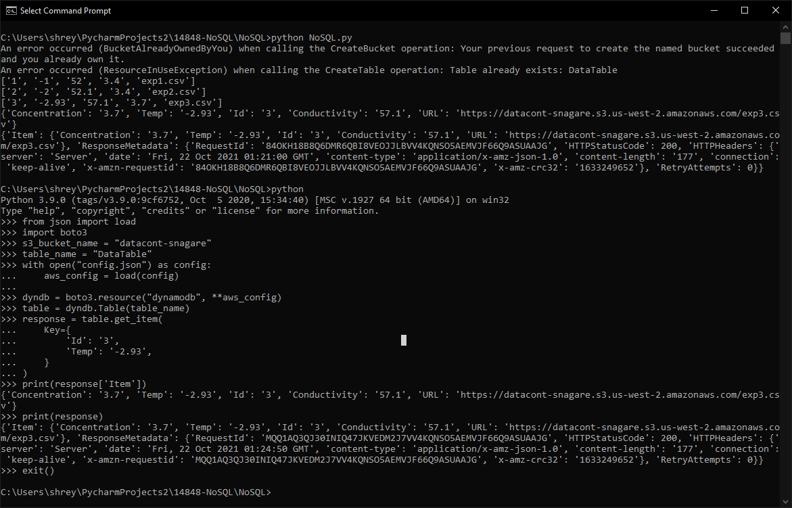

# 14848-NoSQL

## Steps
- `cd NoSQL`
- Update `config.json`
- `python -m pip install -r requirements.txt`
- Run the notebook **OR** `python NoSQL.py`

## Code
- [Jupyter Notebook](NoSQL/NoSQL.ipynb) **OR**
- [Python Script](NoSQL/NoSQL.py)

## Screenshots

